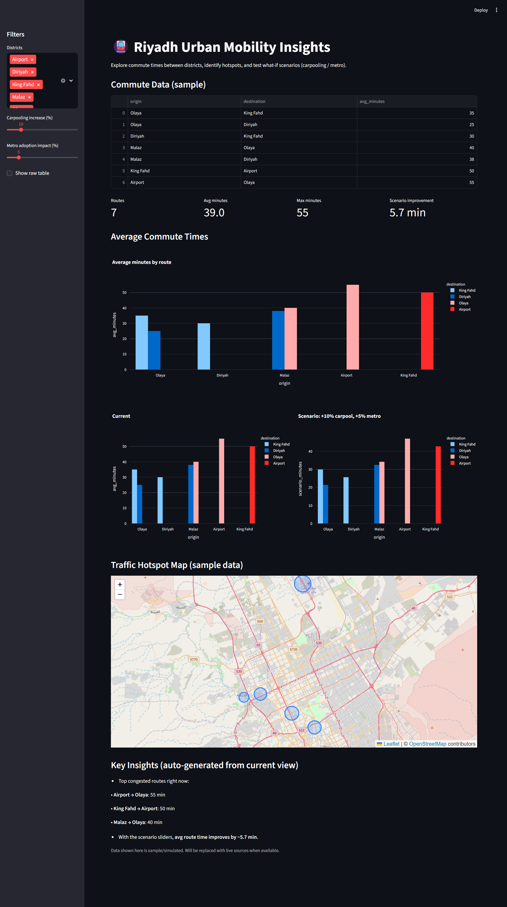
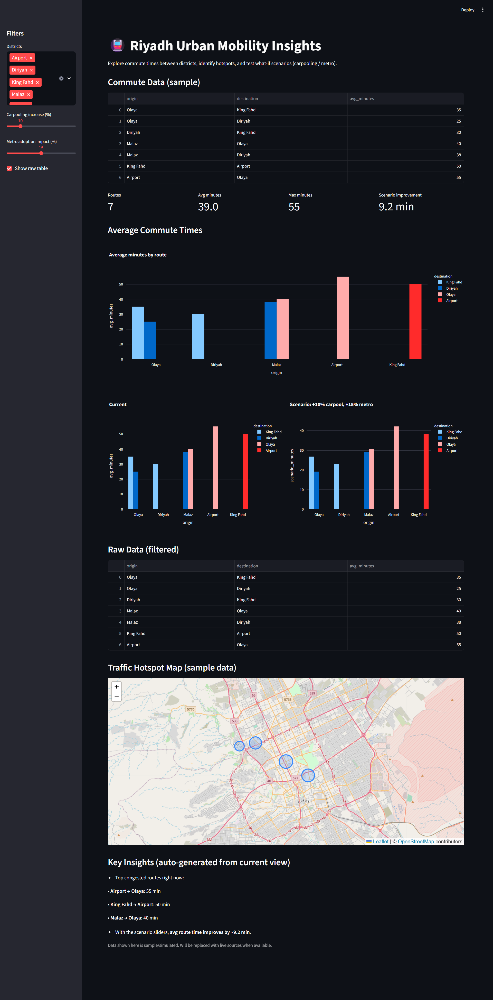

Urban Mobility Insights – Riyadh Edition

An interactive dashboard analyzing commute times and traffic hotspots in Riyadh.
Built with Python and Streamlit, the project explores how carpooling and metro adoption could reduce congestion and improve daily mobility.

---

Problem
Riyadh residents face long commute times and increasing transport costs.
This project uses simulated data to demonstrate how analysis can highlight:
Average commute times between districts
Peak congestion corridors
What-if scenarios such as carpooling and metro expansion

---

Tech Stack
Python (pandas, requests)
Streamlit (dashboard UI)
Plotly / Folium (visualizations and maps)

---

Goals
Collect and simulate travel time data for Riyadh
Build an interactive, scenario-based dashboard
Present consulting-style insights aligned with Vision 2030

---

Screenshots

Scenario 1: +10% Carpool, +5% Metro

Insight: Average route time improves by ~5.7 minutes. Top congested routes remain:
Airport → Olaya: 55 min
King Fahd → Airport: 50 min
Malaz → Olaya: 40 min

Scenario 2: +10% Carpool, +15% Metro

Insight: Average route time improves by ~9.2 minutes. The same corridors remain congested, but the overall improvement is stronger.

---

Results and Insights

The dashboard highlights how relatively small behavioral or infrastructure shifts can have measurable impacts on mobility.

Congested routes today:
Airport → Olaya (55 min)
King Fahd → Airport (50 min)
Malaz → Olaya (40 min)

Scenario 1 (Carpool +10%, Metro +5%): average travel time improves by ~5.7 minutes
Scenario 2 (Carpool +10%, Metro +15%): average travel time improves by ~9.2 minutes

Recommendations
Promote carpooling programs – even modest increases reduce commute times
Accelerate metro adoption to achieve stronger efficiency gains
Prioritize interventions on the three most congested corridors for maximum impact

---

Note
This version uses sample data. With real sources such as Google Distance Matrix API, Uber/Careem estimates, or Riyadh open data, the framework can provide actionable insights that support Vision 2030 mobility goals.

---

How to Run

Clone this repository
git clone https://github.com/<your-username>/urban-mobility-insights.git
cd urban-mobility-insights

Install dependencies
pip install -r requirements.txt

Launch the dashboard
streamlit run app.py
